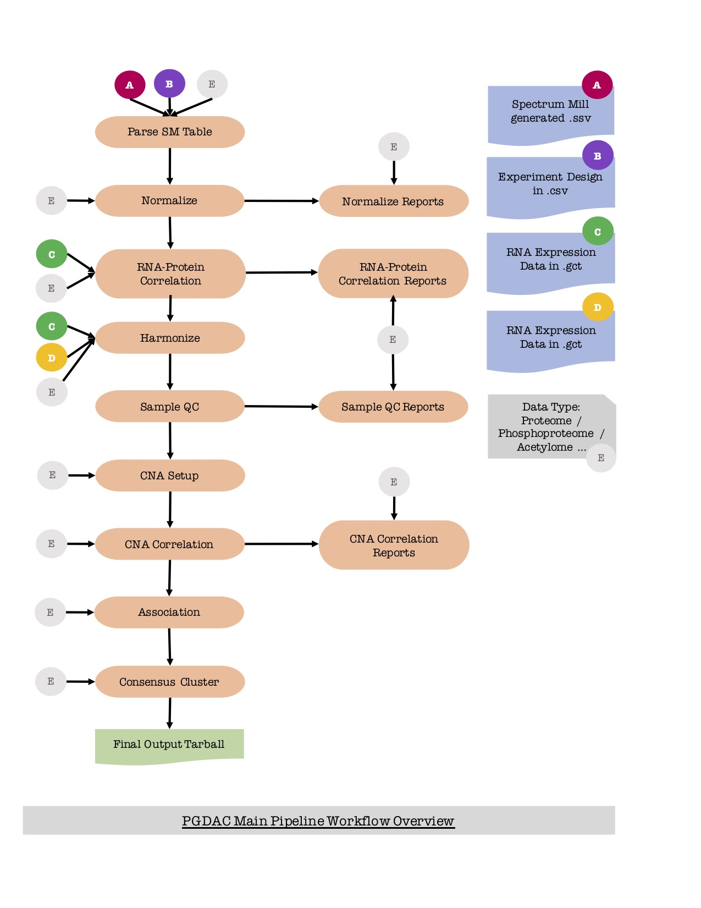

# PANOPLY Pipeline

## NOTE: This repository is under active developement. Documentation may be outdated. 

## Overview of `pgdac_main` workflow



## Required inputs for the `pgdac_main` workflow

Fields listed below are required fields in the inputs `.json` file to the `pgdac-main` workflow. Other fields are optional and can be eliminated. ***NOTE: Make sure that the file paths are absolute file paths. Failing to do so might result in unexpected errors.***

| Field                            | Description                                                           |
|---------------------------------:|-----------------------------------------------------------------------|
| `pgdac_main_pipeline.exptDesign` | Experiment Design File Path                                           |
| `pgdac_main_pipeline.rnaData`    | RNA Expression Data File Path                                         |
| `pgdac_main_pipeline.cnaData`    | CNA Data File Path                                                    |
| `pgdac_main_pipeline.SMtable`    | Spectrum Mill Output File Path                                        |
| `pgdac_main_pipeline.dataType`   | Data Type - "proteome", "phosphoproteome", etc, ...                        |
| `pgdac_main_pipeline.corr_fdr`   | Correlation FDR (float)                                               |
| `pgdac_main_pipeline.analysisDir`| Name of the analysis directory in which you wish to store the results |

In case of input files not from Spectrum Mill (`.ssv`), please use the `pgdac_main_ext` pipeline which has a converter module facilitating the conversion of external file types to `.gct`.

## File formats used in `pgdac_main` workflow

|File                   | Specification                                                                                |
|-----------------------|----------------------------------------------------------------------------------------------|
|Experiment Design File | This file should contain at least Sample.ID, Experiment and Channel columns. Sample.IDs must be unique, valid R names; duplicate samples should have the same sample names but include a replicate.indicator, eg. `.REP`, followed by an unique suffix: `<name>.REP1`. Additional columns in the file will be treated as sample annotation; could be derived from Spectrum Mill `reporter_sample_template`                                                                  |
|`.gct`                 | [version #1.3](https://clue.io/connectopedia/gct_format), [version #1.2](http://software.broadinstitute.org/cancer/software/genepattern/file-formats-guide#GCT). Find more information about converting to `.GCT` from various formats such as (`.txt`, `.cdt`, etc) [here](http://software.broadinstitute.org/cancer/software/genepattern/file-formats-guide).|
|`.cls`                 | Find more information [here](http://software.broadinstitute.org/cancer/software/genepattern/file-formats-guide#CLS). |

## Details of Individual Tasks in the Workflow

All tasks listed below can be executed independently using the `wdl` workflows present in `wdl/tasks`.

| Step                   | Description | Input | Output |
|:----------------------:|-------------|-------|--------|
|Parse                   | Extracts useful and relevant data from the output files generated by [Spectrum Mill](https://www.agilent.com/en/products/software-informatics/masshunter-suite/masshunter-for-life-science-research/spectrum-mill) (SM) software. If there are no sample annotations, writes standard `.gct` 1.2 file, otherwise writes `.gct` 1.3. | <ul><li>`.ssv` file generated by SM</li> <li>`.csv` experiment design file</li> <li>data type (proteome, phosphoproteome, etc)</li> <li>name of analysis directory</li></ul> | tarball of `.gct` files <ul><li>`-intensity`</li><li>`-num-ratio`</li><li>`-num-spectra`</li><li>`-precursor-intensity`</li><li>`-ratio`</li><li>`-reference-intensity`</li><li>`-unique-peptides`</li></ul>|
|Normalize               | <ul><li>Attempts identification of unregulated proteins and phosphosites.</li> <li>Centers the distribution of the iTRAQ log ratios at zero to nullify the effect of differential protein loading and/or systemic MS variation.</li> <li>For all sample types, fits a 2-component gaussian mixture model ([1](https://cran.r-project.org/web/packages/mclust/vignettes/mclust.html), [2](https://cran.r-project.org/web/packages/mixtools/index.html)) using [Expectation Maximization](https://www.rdocumentation.org/packages/mixtools/versions/1.0.4/topics/normalmixEM) algorithm.</li><li>Plots profiles before and after normalization for comparison.</li><li>Plots summary of normalizaton statistics.</li><li>Filters data based on presence/absence, number of iTRAQ ratios for proteins and phosphosites, and their standard deviation across samples.</li></ul> | tarball from the ***Parse*** step, data type |  tarball of `.cls`, <ul><li>`-Experiment.cls`</li><li>`-Subgroup`</li></ul>`.gct`,  <ul><li>`-ratio-median-norm`</li><li>`-ratio-norm-NArm`</li><li>-ratio-norm-noNA</li><li>`-ratio-norm`</li></ul>`.pdf`, <ul><li>`-ratio-median-norm-profile-plot`</li><li>`-ratio-median-norm-stats`</li><li>`-ratio-median-profile-plot`</li><li>`-ratio-norm-profile-plot`</li><li>`-ratio-norm-stats`</li><li>`-ratio-profile-plot`</li></ul> and `.csv` files <ul><li>`-ratio-median-norm-stats`</li><li>`-ratio-norm-stats`</li></ul> |
|RNA-Protein Correlation | <ul><li> Maps protein IDs to gene symbols using RefSeq gene symbol map.</li><li>Measures correlation between mRNA expression and protein/phosphoprotein abundance for each gene-protein pair using [pearson](https://www.rdocumentation.org/packages/stats/versions/3.5.1/topics/cor.test) correlation.</li> <li>Plots profiles for significant correlations.</li></ul> | tarball from the ***Normalize*** step, RNA Expression data, data type | tarball of `.gct`, <ul><li>`rna-seq-sdfilter`</li><li>`rna-seq`</li></ul> `.tsv`, <ul><li>`-mrna-cor-best`</li><li>`-mrna-cor`</li></ul> and `.pdf` files <ul><li>`-mrnan-cor-best`</li><li>`-mrna-cor-combined`</li><li>`-mrna-cor-sig`</li><li>`-mrna-cor`</li><li>`-mrna-sample-sample-cor`</li></ul> |
|Harmonize               | Harmonizes RNA, CNA, and proteome data to create gene-centric tables with samples as columns and genes as common rows. | tarball from the ***RNA-Protein correlation*** step, `.gct` file representing CNA expression file, `.gct` RNA Expression file, data type | tarball of `.cls` <ul><li>`Channel`</li><li>`Experiment`</li><li>`QC.status`</li><li>`Subgroup`</li><li>`cSubgroup`</li><li>`normalization.center`</li><li>`normalization`</li><li>`normalization.scale`</li></ul> and `.csv` files <ul><li>`cna-matrix`</li><li>`-matrix`</li><li>`rna-matrix`</li><li>`sample-info`</li></ul> |
|Sample QC               | <ul><li>Filters by protein-RNA correlation.</li> <li>Samples level correlation between proteome, RNA, CNA with some clustering and fanplots.</li></ul> | tarball from the ***Harmonize*** step | tarball of `.gct` <ul><li>`cna-estimate-scores`</li><li>`-estimate-scores`</li><li>`rna-estimate-scores`</li></ul> and `.pdf` files <ul><li>`sample-qc-plots`</li></ul> |
CNA Setup                | Sets up directories and code for running CNA analysis. | tarball from the ***Sample QC*** step, data type | tarball of `.csv`, <ul><li>`all-cna-matrix`</li><li>`all-[]ome-matrix`</li><li>`all-rna-matrix`</li></ul> `.txt`, <ul><li>`subgroups`</li></ul> and `.tsv` files <ul><li>`file_table`</li><ul> |
|CNA Correlation | Runs CNA analysis to measure correlations of CNA with RNA and proteome expression levels using the [WGCNA](https://cran.r-project.org/web/packages/WGCNA/index.html) correlation calculation library. | tarball from the ***CNA Setup*** step, data type | tarball of `.csv`, <ul><li>`all-mrna-vs-cna-corr`</li><li>`all-mrna-vs-cna-pval`</li><li>`all-mrna-vs-cna-sigevents`</li><li>`all-[]ome-vs-cna-corr`</li><li>`all-[]ome-vs-cna-pval`</li><li>`all-[]ome-vs-cna-sigevents`</li><li>`chr-length`</li><li>`gene-location`</li></ul>`.png`, <ul><li>`all-cna-plot`</li></ul> and other files <ul><li>`all-output`</li></ul>|
|Association             | <ul><li>Runs marker selection using [SAM](http://ugrad.stat.ubc.ca/R/library/siggenes/html/sam.html).</li><li>Uses the best markers to build classifiers using [PLS](https://cran.r-project.org/web/packages/pls/vignettes/pls-manual.pdf), [PAM](http://statweb.stanford.edu/~tibs/PAM/pam.pdf), [GLMNET](https://www.rdocumentation.org/packages/glmnet/versions/2.0-16/topics/glmnet), and RF models.</li><li>Filters out (by removing features with >50% missing values) or imputes missing values using [k-NN](https://www.rdocumentation.org/packages/bnstruct/versions/1.0.2/topics/knn.impute).</li><li>If provided wih test data, runs prediction using all classifiers.</li><li>Plots heatmap of training data showing significant markers.</li><li>Runs [GSEA](http://software.broadinstitute.org/gsea/index.jsp) for 2-class `.cls` files.</li></ul> | tarball from the ***CNA Correlation*** step, data type | tarball of `.gct`. and `.cls` files containing: <ul><li>Classifier performance contingency tables.</li><li>List of significant markers derived using SAM.</li><li>Table of prediction results for training data from all classifiers.</li><li>GSEA Outputs.</li></ul>|
|Cluster                  | <ul><li>Uses consensus clustering.</li><li>Filters proteome data to remove all proteins with missing data and standard deviation <= 1.5.</li><li>Transforms resulting data set into 1000 bootstrap sample data sets.</li><li>Clusters the bootstrap data sets using k-means clustering with upto six clusters.</li></ul> |tarball from the ***Association*** step, data type | tarball of `.png`, <ul><li>`.consensus.all.k.plot`</li><li>`.consensus.all.plot.k[2-8]`</li><li>`.cormatrix`</li><li>`.geneheatmap`</li><li>`geneheatmaptopgenes`</li><li>`.silfig`</li></ul> `.gct`, <ul><li>`-Cluster`</li><li>`-data`</li><li>`-expclu`</li>`normalized`<li></li></ul> `.cls`, <ul><li>`-Cluster`</li></ul> and `.txt` files <ul><li>`.bestclus`</li><li>`.cophenetic.coefficient`</li><li>`.membership`</li><li>`.params`</li><li>`samplebysamples`</li><li>`selectmarker`</li><li>`subclassmarkers`</li></ul>|

### Running PGDAC on your local machine

In order to run the pipeline on your local machine, first clone the repository or download the zip from Github. Make sure you download and store [cromwell](https://github.com/broadinstitute/cromwell/releases) and [wdltool](https://github.com/broadinstitute/wdltool/releases/tag/0.14) in a folder where you want to store the executions and results of your pipelines. ***NOTE: Make sure you pass absolute file paths everywhere and not relative paths to your current working directory.*** Failing to do so might result in unexpected errors. Following commands will prove to be useful:

1. `java -jar wdltool.jar validate <WDL File>` you can perform full validation of the WDL file including syntax and semantic checking.
2. `java -jar wdltool.jar inputs <WDL File> > <your_inputs>.json` to print a `.json` skeleton file of the inputs needed for this workflow. Fill in the values in this `.json` document and pass it in to the `run` subcommand.
3. `java -jar cromwell.jar run [options] <your_wdl_file> -i <your_inputs>.json` to run the workflow through the cromwell engine and print out the outputs in `.json` format.


### Other Information

The ```docker``` directory contains code to create required docker images for use with the PGDAC pipeline.
The ```r-util``` image includes R code from https://github.com/broadinstitute/proteomics-Rutil,
and is the basis for the ```broadcptac/pgdac_main``` image.

The essential code for the ```pgdac_main``` image is contained in the ```src``` directory,
with the associated workflow in the ```wdl``` directory. ```firecloud``` contains
FireCloud documentation and supporting files needed to run workflows.

In order to follow the instructions in ```docs/Firecloud workflows from R code modules.ipynb```,
clone the ```gdac-firecloud``` repository from https://github.com/broadinstitute/gdac-firecloud
into the root ```PGDAC``` directory.

#
# Contact
#

Email manidr@broadinstitute.org with questions.
